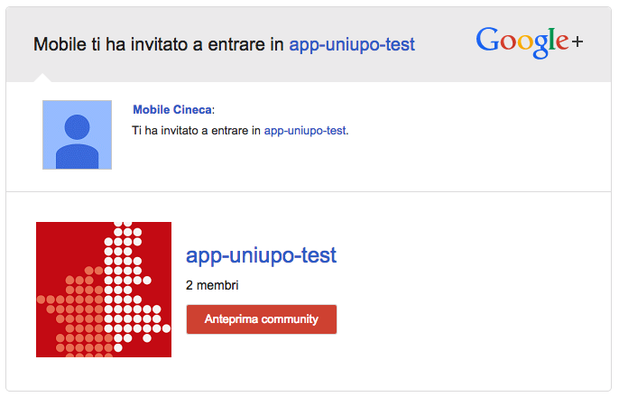
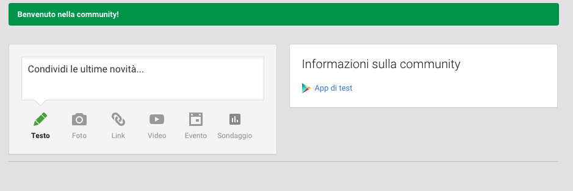

Diventare un tester di applicazioni Android
===
Per poter testare le app mobile su piattaforma Android, Google mette a disposizione un servizio di aggiornamento automatico basato sul Play Store.
Istriversi a questo servizio è un po macchinoso, ma garantisce gli aggiornamenti automatici delle app quando lo sviluppatore pubblica una nuova versione.

Il servizio di cui parliamo è basato sulle Community di Google e funziona in questo modo:

* Lo sviluppatore crea una Community specifica per l'app (es: app-unixx-test)
* Lo sviluppatore invia una mail di invito al tester per consentirgli di entrare nella Community
* Nella mail ricevuta, il tester clicca il pulsante **Anteprima community**

* Si viene reindirizzati nella pagina della community di google, in cui il tester deve cliccare il pulsante **Accetta invito**
* Ora sulla parte destra della pagina cliccare sul link **App di test**

* Nella pagina successiva cliccare sul pulsante **DIVENTA UN TESTER**
* Nella pagina successiva, in basso cliccare nel link **Scarica UniXX dal Play Store**

* A questo punto si e' indirizzati nella pagina del play store. Cliccare su **Installa** e scegliere il dispositivo android su cui si desidera installare l'app.
