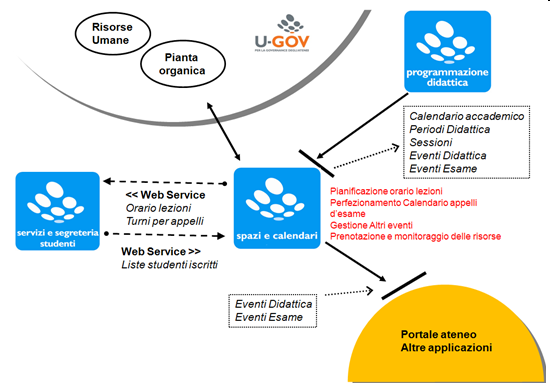

Introduzione
---
Questo manuale illustra il funzionamento del modulo aggiuntivo per la  gestione della logistica di ateneo. L’applicazione nasce con lo scopo di consentire - in generale - la pianificazione di tutte le attività tipiche del contesto universitario, con particolare riferimento alle attività didattiche e gli esami, in termini di durata, docenti, tipologia, e altre caratteristiche specifiche. In secondo luogo è possibile anche la pianificazione di “altre attività”, quali ad esempio consigli di Strutt. Org., riunioni periodiche, seminari, conferenze, ecc…, per le quali gestire in termini spazio-temporali gli impegni delle singole persone coinvolte.  Ricadono sotto il dominio dell’applicazione tutte le attività di calendarizzazione di eventi che impegnano strutture fisse o mobili dell’ateneo.

Scenario di utilizzo
---
Le esigenze fondamentali a cui risponde l’applicazione sono da un lato la progettazione dell’orario di lezione dei corsi di laurea, dall’altro il poter disporre di un applicativo per il monitoraggio costante dell’occupazione delle aule e/o di altre strutture dell’ateneo. L’applicazione richiede dunque una mappatura precisa e dettagliata di tutte le strutture fisiche di cui l’ateneo può disporre. Inoltre si possono definire responsabili di tali strutture che avranno Strutt. Org. di approvazione nell’allocazione di un evento. L’output del sistema sarà dunque il calendario dettagliato di tutti gli eventi legati ad una risorsa fissa o mobile, il calendario di gruppi di eventi (corsi di studio) o di persone fisiche (docenti, studenti) o virtuali (commissione d’esame,ecc..).

L’applicazione non dispone allo stato attuale di un “motore” di generazione di orari in ipotesi, cioè di un algoritmo che calcoli in base a dei vincoli prestabiliti le migliori configurazioni di orario. Si è giudicato più utile infatti, in fase di raccolta requisiti, un programma in grado di gestire controlli di congruenza (configurabili) ad uso di un utente coordinatore che “manualmente” aggiusti l’orario con l’aiuto di tali controlli.
La fase di creazione e la tipizzazione degli eventi che il sistema gestisce, è per sua natura pensata per essere “pilotata” da applicazioni terze. Ad esempio, attualmente è U-GOV programmazione didattica o ESSE3 che alimenta il sistema con i dati relativi agli insegnamenti nel massimo dettaglio della loro struttura e caratteristiche.

Il ciclo gestionale della logistica
---
Il ciclo della gestione logistica delle risorse di ateneo, può essere riassunto in tre macro fasi, non necessariamente sequenziali, che possono pertanto essere considerate  anche simultaneamente da parte di un operatore:

1. Pianificazione: è la fase che coincide con la prima stesura di orario  - preventivo - possibilmente schematizzabile se si tratta di un evento ricorsivo (es: orario delle lezioni), o di un semplice calendario di date singole  (es: orario degli esami).
2. Gestione delle variazioni: una volta iniziate le attività, con il trascorrere del tempo, il calendario preventivo può certamente subire variazioni singole, che possono essere gestite al fine di una comunicazione precisa e puntuale verso le persone coinvolte, e parallelamente per monitorare l’effettivo utilizzo delle risorse
3.  Monitoraggio: per monitoraggio si intende un possibilità di rilevare a consuntivo l’effettivo svolgersi degli  eventi programmati e  la reale occupazione delle risorse. Tali misurazioni – fatte normalmente a campione - possono essere poi oggetto di analisi statistica, o utilizzate dal sistema di supporto alle decisioni.
