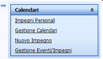
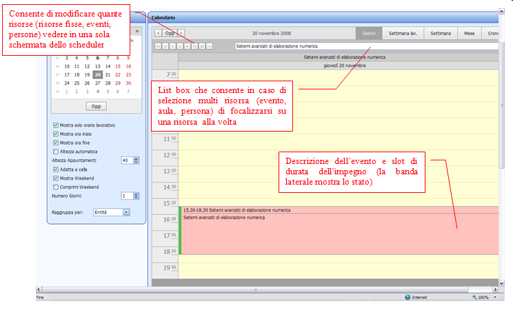
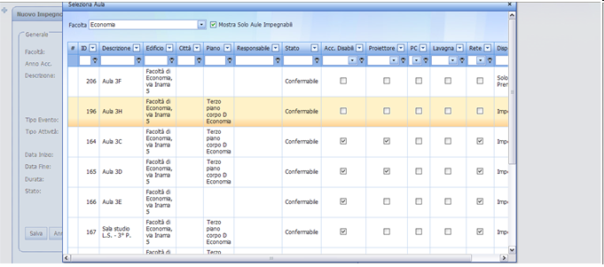
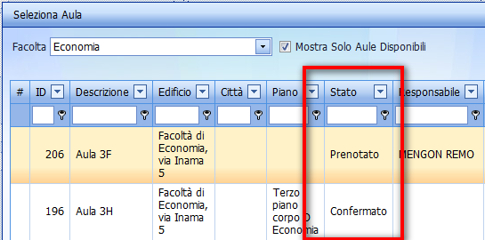
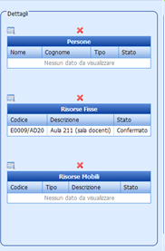
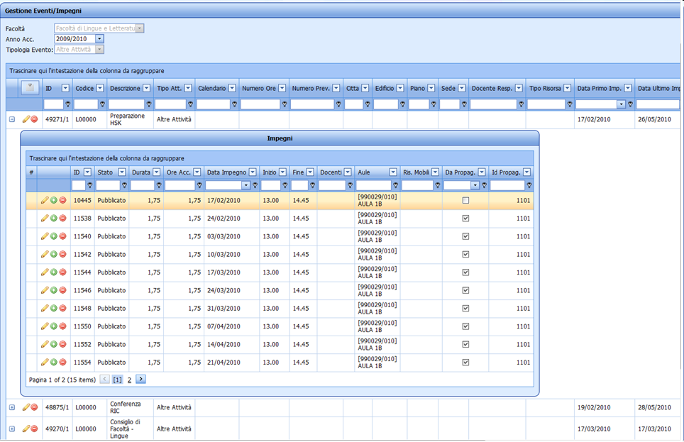
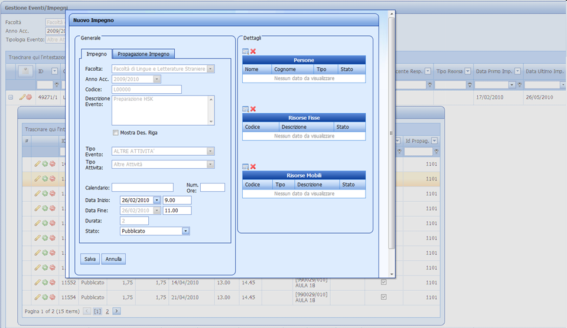

Calendario
---

Impegni personali
---

Questa funzione consente di gestire e monitorare la propria agenda degli impegni personali. Lo scheduler si posiziona filtrando automaticamente tutti gli impegni associati all’utente collegato.

N.B Se l’utente collegato è di tipo prenotatore, e come modalità operativa ha optato per essere sempre incluso come persona associata agli impegni da lui creati, potrà monitorare da tale vista tutte le prenotazione effettuate.

Inoltre se l'utente ha creato un impegno con una risorsa fissa con stato impegnabilità Con Autorizzazione, vedrà nel dettaglio dell'impegno lo stato della risorsa fissa in Prenotato e non in Confermato.

Gestione calendario
---
La funzione calendario permette di consultare l’orario di eventi secondo molteplici modalità a seconda delle esigenze dell’utente:

* per persona
* per evento
* per risorsa

Ogni utente può configurarsi in modo flessibile il tipo di vista desiderato utilizzando vari parametri. Salvato il layout, esso rimane invariato anche per i successivi accessi alla procedura da parte dello stesso utente. Entrambi i menù laterali a sinistra sono chiudibili e riapribili, consentendo di recuperare spazio per una più ampia visualizzazione del calendario stesso.

* Toolbar di salvataggio e caricamento dati

* Menu laterale: proprietà del calendario

Come default il calendario si apre visualizzando con vista giornaliera gli impegni delle risorse fisse della Strutt. Org. corrente. Ma è possibile attraverso l’apposito tasto “Modifica Filtro” effettuare delle ricerche mirate per evento, per docente, per  risorsa fissa /mobile.

Per evitare ricerche troppo pesanti è presente  però un macro filtro con dei default modificabili, ad esempio per gli eventi:

* Data inizio (data corrente)
* Anno accademico
* Strutt. Org. (dell’utente corrente)
* Tipo attività (didattica, altre attività. Esami)

Il filtro può essere fatto utilizzando gli spazi bianchi nella testata delle colonne per  posizionarsi sul set di dati secondo le descrizioni presenti in ciascuno.

'''N.B''' Una volta definito il filtro cliccando su “Mostra calendario”, nello scheduler verranno caricati tutti gli impegni corrispondenti al set di eventi/risorse selezionate.  E’ quindi possibile visualizzare nello stesso scheduler più impegni a un tempo. Ad esempio tutte le attività di un certo CDS, di un certo anno di corso. Oppure tutti gli impegni delle aule di un certo edificio/piano.

Nuovo Impegno
---
La funzione permette di creare un evento - impegno con le caratteristiche essenziali per la sua calendarizzazione e allocazione nelle strutture dell’università. L’utente può creare un semplice impegno indicando giorno, ora, durata e le caratteristiche dell’evento (descrizione, e tipo: attività didattica, esame, conferenza, ecc..).

Generale:

* Nuovo/modifica impegno: descrizione dell’impegno-evento
* Data: per default propone la data corrente
* Ora: ora di inizio
* Durata: durata effettiva in ore
* Ore accademiche: nel caso di utilizzo di slot di ore personalizzati indica il numero di ore accademiche utilizzate dall’impegno
* Stato: stato dell’impegno: confermato, non confermato, pubblicato, sospeso

Caratteristiche dell’evento:

* Tipo evento: indica il tipo di evento (attività didattica, esame, ecc..)
* Calendario dell’evento: indica quale calendario è associato all’evento
* Partizionamento: nel caso di attività didattica specifica la partizione

Una volta creato l’evento-impegno, la procedura consente di effettuare prenotazione di risorse fisse o mobili, e di coinvolgere altre persone nell’evento utilizzando gli appositi tasti

Apri risorse fisse:

Apre una look up che mostra tutte le risorse compatibili all’evento, e consente di specificare quale risorsa fissa fra quelle con caratteristiche indicate richiedere

Lo stato della risorsa fissa può essere Prenotato o Confermato a seconda dello stato di impegnabilità deciso dai pianificatori.
L'utente lo trova in Confermato che significa che la risorsa fissa è disponibile sempre, mentre lo può vedere in stato prenotabile, quando l'aula è appartente da un'altra Strutt. Org. o quando richiede l'autorizzazione dal responsabile della risorsa fissa.

In modo analogo la procedura consente di prenotare risorse mobili, e coinvolgere altre persone con l’utilizzo degli apposti tasti

* Apri risorse mobili
* Apri persone

Cliccando sul pulsante **Aggiungi utente connesso** si aggiungetà alla lista di persone l'utente attualmente connesso a UP.

Una volta effettuata la prenotazione, sarà possibile consultare nel riquadro laterale di dettagli, quali risorse sono state richieste, se sono state confermate, e quali persone sono coinvolte nell’evento.

Gestione Eventi/Impegni
---

La maschera in questione permette di gestire gli eventi e gli impegni di tipologia “Altre Attività”, “Esami” o “Lezioni” della Strutt. Org. di appartenenza dell’utente.
Solo l’utente con ruolo Supervisore può gestire  gli eventi di qualsiasi tipologia e Strutt. Org..

La maschera mostra un filtro per anno accademico. Di default viene mostrato quello che include la data corrente.

La maschera principale mostra le caratteristiche degli eventi filtrati, sia dell’evento che  quelle dell’evento riga.

E’ possibile modificare o eliminare l’evento.
Per eliminare l’evento cliccare il pulsante a forma di cestino e l’applicativo mostrerà un messaggio di conferma. Cliccando su “OK” verrà cancellato l’evento e i rispettivi impegni.

Per modificare l’evento cliccare sul pulsante a forma di matita, verrà mostrata una maschera con le caratteristiche dell’evento che è possibile cambiare.

Le caratteristiche dell’evento sono suddivise in tre cartelle: proprietà generali, logistica e didattica.
Per confermare le modifiche apportate cliccare sul pulsante di conferma verde, per annullarle cliccare sul pulsante rosso.

E’ anche possibile aggiungere o togliere delle colonne, cliccando sul pulsante “Mostra elenco colonne” verrà mostrato un menu con l’elenco delle colonne che è possibile aggiungere. Cliccando con il tasto sinistro del mouse su una colonna del menu e trascinandola fra due colonne già presenti, questa verrà aggiunta. Allo stesso modo trascinando una colonna presente nella griglia dentro al menu questa verrà tolta.

Cliccando sul pulsante  nella riga di un evento verranno mostrati come dettagli gli impegni di tale evento.

Ogni riga corrisponde a un impegno, nelle colonne sono presenti oltre alle caratteristiche temporali anche i docenti le risorse fisse e mobili associate. Inoltre viene mostrato se l’impegno fa parte di una propagazione e l’id di tale propagazione.
E’ possibile modificare o cancellare un impegno presente, oppure crearne uno nuovo.
Per creare un nuovo impegno cliccare sul pulsante verde, verrà aperta una maschera che permette di creare un nuovo impegno per l’evento in testata.

Nella maschera è possibile cambiare solo i dati che identificano l’impegno:

*	data inizio
*	ora inizio
*	ora fine
*	stato
*	risorse associate

Una volta inseriti questi dati cliccando su “Salva” verrà creato il nuovo impegno. Quando si crea un nuovo impegno è possibile anche propagarlo, per fare ciò cliccare sul tab “Propagazione Impegno” e inserire i dati per la propagazione, cliccando su “Salva” verrà salvato il singolo impegno e creati gli impegni propagati secondi i dati inseriti.
Per modificare un impegno cliccare sul pulsante a forma di matita, verrà aperta una maschera che permette di modificare le caratteristiche dell’impegno, ciccando su “Salva” verranno apportate le modifiche all’impegno selezionato.
Per eliminare un impegno cliccare sul pulsante rosso, verrà in automatico eliminato l’impegno senza la richiesta di conferma.
