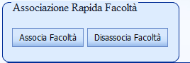

Configurazione
---
Il sistema richiede una configurazione preliminare, che è possibile gestire direttamente via web dall’apposito menù, che da accesso a tutte le tabelle essenziali. Il sistema di configurazione gestisce anche i dati necessari alla pianificazione logistica delle attività.

Le tabelle del sistema sono raggruppate in “anagrafiche di base” e in tabelle contenenti le principali entità in gioco: Persone, Risorse, Eventi, Calendari. Ciascuna di queste contiene a sua volta una serie di tabelle di configurazione di base.

Anagrafiche di base
---
Le anagrafiche di base sono tutte le tabelle delle principali entità strutturali del programma

====Tabelle importate da ESSE3:====
Di questa sezione fanno parte tutte le tabelle che vengono importate da ESSE3, per le quali dunque sono disabilitate le funzioni di aggiunta e cancellazione. E’ invece possibile modificarne le caratteristiche. A queste tabelle vanno aggiunte quella delle persone (solo per quanto riguarda i docenti) e delle risorse fisse.
Per aggiungere nuovi dati necessari occorre quindi aggiungere prima il dato in ESSE3 ed effettuare l’import del nuovo dato

====Strutture organizzative (''Facoltà prima della Rel. 12.01.00.00'')====
La tabella delle Strutture organizzative dell’ateneo, che sono caratterizzate da codice e  descrizione.{br}
'''NB:''' questa anagrafica sostituisce Facoltà e Dipartimenti, che vengono unite in un'unica tabella con tipologia differente.

====Città====
La tabella presenta l’anagrafica delle città italiane

====Edifici====
La tabella consente di gestire le anagrafiche degli edifici a disposizione dell’ateneo per la pianificazione delle risorse fisse o mobili.

====Tipi Attività====
Sono le descrizioni codificate delle tipologie di attività didattica, con cui vengono tipicamente dettagliati gli insegnamenti (lezioni, laboratori, esercitazioni, ecc…)

====Attività Didattiche====
Le attività didattiche sono gli insegnamenti, o comunque tutto ciò che corrisponde all’ erogazione di una attività formativa universitaria volta al riconoscimento nella carriera degli studenti. Ai fini del sistema vengono qui gestiti come dati fondamentali sono codice e descrizione

====Corsi====
Questa tabella contiene i codici e le descrizioni dei corsi di laurea offerti dall’ateneo. Per corsi di studio nella eccezione più ampia si intendono tutti i corsi oggetto di programmazione didattica o pianificazione logistica (Corsi di laurea, dottorati, corsi interni per il personale, ecc..)

====Qualifiche====
Sono l’attributo fondamentale del tipo persone “docenti”, che indicano quale ruolo essi possono assumere nelle attività didattiche. In base alla qualifica (codice e descrizione) un docente sarà classificato inoltre come interno o esterno.

====Lingue====
Lingue con cui gestire il programma di studio della singola attività didattica.

====Settori Scientifico Disciplinari====
Tabella dei settori scientifico disciplinari codificati dal MIUR (MAT/01, MAT/02,…)

====Ambiti====
Sono i raggruppamenti ufficiali dei settori scientifico disciplinari stabili da MIUR, a questi possono aggiungersi presso alcuni atenei ambiti di sede

====Tipo Attività Formativa (TAF)====
Tabella delle tipologie di attività formative codificate dal MIUR (Es: di base, caratterizzante, affine-integrativa,…)

====Tipi Partizionamento====
E’ un attributo di una attività didattica che indica con quale criterio sono stati eventualmente divisi (AK, LZ, matricole pari/dispari, ecc..)

====Percorsi====
Sono i curricula, gli indirizzi che lo studente può scegliere all’interno di un Corso di studio.

====Anni Accademici====
La tabella memorizza tutti gli anni accademici con i quali il sistema dovrà lavorare

====Contesti====

Di seguito viene descritto la configurazione dei contesti. Questa sessione di configurazione è presente solo nel WEB, ma influenza a seconda degli utenti, anche la parte Client di UP.
All'interno del WEB, è necessario configurare correttamente i contesti per ogni utente.

Ogni utente, al login sia nella applicazione WEB o Client, dovrà scegliere un contesto e, con questo,
circoscriverà il proprio ambito di lavoro a determinati Docenti, Risorse Fisse ed Eventi.

Questi insiemi, con gli Utenti associati al contesto, sono visibili cliccando sull’icona +:

Ad ognuno di questi insiemi sono associati dei livelli di collegamento con le altre tabelle, per poter definire/collegare i vari Docenti, Risorse e
Eventi a:

Strutture Organizzative: si associano al contesto
gli elementi (nella figura, i Docenti) già collegati alle strutture
organizzative.

Associativa Contesti: si associano al contesto
gli elementi (nella figura, le Risorse Fisse) direttamente presi
dall’anagrafica di base.

CDS: si associano al contesto gli elementi (nella figura, gli Eventi) già collegati ai Corsi di Studio.

Per ognuno degli insiemi di elementi, è associato un Gruppo
Permesso (vedere il paragrafo relativo).

====Gruppi Permessi====

Permette la gestione di permessi (prenotabilità/confermabilità/ condivisibilità con prevalenza o no dell’aula, lettura, scrittura, CRUD e fasce temporali di calendario) per gestire, nel client, l’utilizzo delle Aule, dei Docenti e degli Eventi durante pianificazione dell’orario.

__Un gruppo di permessi è utilizzato durante la definizione di un Contesto associato a Docenti, Eventi e Aule__.

Si definisce come Gruppi per il fatto di poter definire insiemi di permessi con più di una delle caratteristiche  sopracitate attive contemporaneamente.  

Oltre il codice e la descrizione, nella definizione di un Gruppo di permessi, possiamo associare quindi:
*	Permesso: tipo di permesso preconfigurato:
**	Docente sola lettura
**	Docente completo (CRUD)
**	Aula sola lettura
**	Aula completo (CRUD)
**	Eventi sola lettura
**	Eventi completo (CRUD)
**	Aula uso esclusivo
**	Aula condivisa prevalente
**	Aula condivisa non prevalente

Gli effetti sulla pianificazione con l’uso di un’aula associata a questi permessi, nel client, sono, ad esempio:

*	Aula  in sola lettura:  non consente di draggare impegni dentro la maschera/ non visualizza l’aula tra quelle disponibili
*	Aula uso esclusivo:  consente di modificare i propri impegni. Gli altri contesti non possono utilizzare l’aula
*	Aula condivisa prevalente:  consente di modificare i propri impegni e quelli degli altri contesti che utilizzano l’aula. Nel caso si disponga anche del permesso ''Aula Condivisa alla Pari'' i due permessi hanno lo stesso significato
*	Aula condivisa non prevalente: consente di modificare i propri impegni, ma non quelli degli altri contesti che utilizzano l’aula con un permesso diverso. Posso modificare gli impegni di altri contesti con permesso ''Aula Condivisa Prevalente''.

*	Calendario: fascia temporale di validità del premesso. Può valere per periodi dell’anno e periodi di orari all’interno della giornata (mattina, pomeriggio ecc…). Usato per le aule per stabilire la fascia temporale in cui è possibile pianificare un impegno cui è associata l’aula.
*	Visibilità
*	Abilitazione: validità del permesso per Eventi, Aule e Docenti. Possono essere utilizzati assieme per il medesimo gruppo (vedi READONLY e CRUD nella figura).

====Modalità didattiche====
Modalità di insegnamento delle attività didattiche.

====Sedi====
In questa tabella sono memorizzate tutte le sedi italiane.

====Tipi Corso====
Contiene tutti i tipi di corso ai quali possono iscriversi gli studenti.

====Tipi Strutture Organizzative====
Memorizza tutti i vari tipi di Strutt. Org.

Import/export dati
---

====Import da ESSE3====
La funzione consente di effettuare import di dati da ESSE3

In particolare consente l’import delle '''tabelle di base''' (vedi anagrafiche successive), per le quali la procedura effettua un import incrementale: cioè è possibile lanciare la procedura di import più volte senza impattare sui dati delle tabelle già importati. {br}
Per quanto riguarda invece gli '''eventi '''(attività didattiche ed esami) e i '''vincoli '''(regole di scelta) la procedura di import __'''riscrive tutte le volte'''__ i dati, __'''cancellando'''__ quelli precedentemente inseriti, è quindi fortemente sconsigliato allo stato attuale effettuare l’import in più soluzioni.

N.B è necessario impostare correttamente '''l’anno accademico sorgente '''e quello di '''destinazione'''. Tipicamente verrà fatto l’import da un anno precedente solo per creare la base dati di lavoro per la programmazione didattica. {br}
  Al termine dell’elaborazione viene visualizzato il log della procedura, con segnalazione del numero di record importati e degli errori o scarti effettuati

====Trace====  
  La funzione consente di visualizzare l’esito delle procedure massive di caricamento dati in UniversityPlanner

=====Messaggi di LOG=====

* '''Inizio Procedura / Fine Procedura'''
I messaggi di Inizio e Fine Procedura assumono valori significativi nel momento in cui l’utente finale sceglie di eseguire la copia template impegni per tutte le strutture organizzative, in quanto nel log viene inserita una riga per identificare l’inizio e la fine della copia template di ogni singola Struttura organizzativa. Tutto quello che si trova tra questi due ID è riguardante la struttura organizzativa presente nella descrizione.
[image||{UP}/UP/up_manual_20110714_151100.png]

* '''Errore'''
La tipologia Errore nei messaggi, viene usata per evidenziare quegli impegni che sono stati copiati ma con qualcosa di mancante (es. date periodo).
Per esempio se non è stata trovata la corrispondenza del periodo nel calendario degli eventi futuri, il log riporta il messaggio:

``date del periodo non inserite per l'impegno collegato all'evento DESCRIZIONE EVENTO e ANNO.``

Inoltre sempre in questa categoria di messaggi possiamo trovare gli errori che sono stati rilevati dal data base durante l’inserimento o la cancellazione di impegni, in questo caso è necessario contattare direttamente il sistemista.

* '''Warning'''
Nei Warning vengono racchiusi tutti quei messaggi nei quali ci sono stati piccoli problemi, tipo se i numeri degli eventi logici e fisici sono di numeri diversi tra i due anni, di seguito un elenco dei possibili messaggi di warning:
``Evento Futuro NON Trovato Evento: 2010|2011|1|2008|0115G|P0001|120006|120006/2|N0\N0|########|S1

Numero eventi diversi tra i due anni, per l'evento di partenza: 2010|2011|1|2003|0112D|P0003|22051|22051|A1\LZ|########|S2

TEMPLATE_IMPEGNI date del periodo non inserite per l'impegno collegato all'evento 21018 Statistica per i mercati finanziari|2011

Presenza di più Eventi Riga Evento: 2010|2011|3|2008|0327G|P0403|140077|140077/1|N0\N0|########|S1``

La stringa che è presente nei messaggi di warning è così composta:

``2010|2011|1|2008|0115G|P0001|120006|120006/2|N0\N0|########|S1``

``''ANNO di Partenza | Anno di Arrivo | progressivo Strutt. Org. | Anno Ordinamento | Codice Corso | Codice Percorso |  Codice Attività Didattica |  Codice UD | Codice Partizionamento | Codice Sede | Codice Periodo''``

* '''Altro'''
Con la tipologia '''ALTRO''', il sistema evidenzia il numero di impegni che ha trovato nell’anno di partenza e quelli che ha copiato nell’anno di arrivo.

[image||{UP}/UP/up_manual_20110714_125200.png]

In questo modo se si sceglie in caso di copia modalità incrementale, si riesce ad avere una visione immediata di quanti impegni sono stati copiati da un anno accademico all'altro.

====Allineamento Docenti====

La maschera "Allineamento Docenti" permette di verificare gli impegni di Didattica che hanno docenti assegnati non allineati con i docenti assegnati a livello di Evento. Una volta verificati questi impegni c’è la possibilità di riallineare i docenti assegnati, cioè sostituire i docenti assegnati all’impegno con quelli assegnati all’Evento dell’impegno (che si assume siano quelli validi). La visibilità di questa maschera è esclusiva per gli utenti di ruolo "Supervisore" e si accede dal menu di Configurazione, Import Export, Allinea Docenti. La maschera permette di cercare gli impegni in due modalità:

# ricerca per calendario
# ricerca da data a data

=====Ricerca modalità Calendario=====

Questa modalità di ricerca permette di selezionare un calendario dalla drop down list, la funzione recupera tutti gli impegni degli eventi che hanno tale calendario associato. Per facilitare la ricerca si può scrivere dentro la dropdown list e in automatico verranno filtrati i calendari che iniziano con tale descrizione.

=====Ricerca modalità Da data A data=====

Questa modalità di ricerca permette di selezionare una data inizio e data fine per le quali verranno filtrati gli impegni.

Una volta impostato un filtro cliccando sul pulsante "Cerca" verrà elaborata la ricerca degli impegni non allineati per tale filtro. Terminata l’elaborazione verrà visualizzata una griglia con l’elenco degli impegni trovati e con le relative caratteristiche.

Individuati gli impegni non allineati si possono selezionare quelli che si intendono allineare (per selezionarli o deselezionarli tutti utilizzare i due pulsanti in alto nella prima colonna). Una volta selezionati cliccando sul pulsante "Allinea Docenti Impegno" verrà lanciata l’elaborazione di allineamento per gli impegni selezionati, alla fine di tale operazione verrà restituito un messaggio all’utente che avvisa se l’operazione è andata a buon termine o se sono occorsi degli errori.

====Copia Settimana Template==== (dalla release 11.02.00.00)

La maschera “Copia Settimana Template” è visibile ai soli utenti con ruolo: supervisore, configuratore e pianificatore.

La maschera permette la copia  degli impegni presenti di una certa Strutt. Org. nella settimana template da un anno accademico all’altro.

Gli utenti con ruolo supervisore e configuratore possono permettere la copia della settimana template anche per “tutte le Strutt. Org.”.

La procedura di copia, parte considerando tutti gli eventi dell’anno di partenza che sono '''visibili''' e con '''stato diverso da ELI''', confronta a seconda della metodologia di copia e a seconda dei vari flag attivati dall’utente, gli eventi dell’anno successivo che siano visibili e con stato diverso da ELI.

A seconda dell’integrazione di UP si comporta in modo differente.

''Integrato con ESSE3'', oltre all’''anno accademico'' e la ''Strutt. Org.'' scelti, gli eventi dell’anno successivo vengono equiparati considerando l’offerta didattica, così considerata:

''Anno Ordinamento, Corso, Percorso di studio, Attività Didattica, UD ''

Mentre per quanto riguarda l’''Anno Regolamento''  viene equiparato con l’anno di regolamento + anni di differenza tra gli anni da copiare. Inoltre viene considerata anche la parte della Logistica equiparando il ''Partizionamento studenti'' e il ''Periodo''

''integrato con U-GOV'', la procedura di copia considera, oltre ''Strutt. Org.'' e l’''anno accademico'', la seguente offerta didattica:

''Anno Ordinamento, Corso, Percorso di studio, Attività Didattica, UD ''

E per l’'''Anno Regolamento'''  si considera sommando la differenza tra gli anni da copiare.

Per la parte della Logistica di U-GOV si considera oltre al ''Partizionamento studenti'' e ''Periodo'' anche, se presente, la ''Sede''.

Analizziamo ora i vari campi di scelta che l’utente può selezionare presenti nella maschera.

Il '''Tipo Copia''', può essere:  ''Incrementale'' o ''Cancella'' e ''Copia''.

Modalità''''' Incrementale''''': il sistema se trova l’evento corrispondente con i criteri sopra riportati, presente nell’anno accademico di arrivo, controlla che tale evento non sia già presente nella settimana template del nuovo anno. Se è presente non esegue alcuna operazione, mentre se non è presente inserisce l’impegno, considerando anche gli altri criteri scelti dall’utente.

Modalità ''Cancella e Copia'': dopo aver trovato l’evento corrispondente nell’anno nuovo, '''cancella''' tutti gli impegni presenti nella settimana template per quella Strutt. Org. e per quell’anno. Poi a seconda delle scelte dell’utente esegue la copia.

Scelte aggiuntive da parte dell’utente finale

* '''Copia Veloce'''
__Check attivo__: copia direttamente l’impegno presente nella settimana template, se l’evento fisico dell’anno successivo, è stato trovato, senza eseguire successivi controlli.

__Check NON attivo__: controlla il pacchetto completo dell’evento dell’anno successivo, andando a confrontare tutti gli eventi logici dell’anno di partenza con gli eventi logici dell’anno successivo. I confronti tra i due eventi vengono eseguiti sempre con le chiavi condizionali riportate sopra

Se il sistema trova la corretta corrispondenza tra eventi logici, allora copia direttamente l’impegno.
Durante la copia sia che sia alzato o meno il check del copia veloce, il sistema esegue altri controlli riguardanti i '''calendari''' presenti negli eventi e le '''date del periodo''' dell’impegno.
Se le date del periodo dell’impegno di partenza sono presenti, allora il sistema cerca il calendario corrispondente dell’evento futuro, ed inserisce l’impegno nella settimana template con le date trovate. Se viene a mancare la corrispondenza tra i due calendari, allora nel nuovo impegno vengono inserite le stesse date dell’impegno di partenza aumentando il solo anno nella data.
Mentre se le date del periodo dell’impegno non sono presenti, cerca sempre se esiste il calendario dell’evento, altrimenti inserisce l’impegno privo di date e segnala all’utente nel log l’errore verificatosi.

* '''Copia Stato Bozza'''
__Check attivo__: il sistema cerca di copiare anche gli impegni presenti nella settimana template dell’anno di partenza, nella settimana template dell’anno successivo.

__Check NON attivo__: il sistema esclude dalla copia gli impegni che non sono stati pubblicati.

* '''Copia Note'''
__Check attivo__: vengono copiate le eventuali note presenti nell’impegno della settimana template.

__Check NON attivo__: le note non vengono considerate.

Dopo aver inserito i criteri di copia, l’utente finale esegue l’operazione cliccando sul pulsante copia, a questo punto il sistema elabora e restituisce con un messaggio l’esito della operazione. Se l’operazione ha ottenuto esito positivo, il sistema visualizza un LOG dove vengono segnalate le operazioni eseguite.

Analisi del LOG che il sistema restituisce ad operazione conclusa.

L’utente finale nel momento della conclusione della copia della settimana template, si trova una maschera riportata sotto, dove vengono visualizzati i messaggi salvati sul LOG dal sistema durante l’operazione.

A seconda del tipo del messaggio (Inizio Procedura, Altro, Warning, Errore, Fine Procedura) l’utente visualizza immediatamente se sono stati rilevati ERRORI durante l’operazione.

Persone
---

Le persone raccolgono i dati di tutti i principali attori dell’attività universitaria, i cui dati servono sia ai fini della organizzazione che dell’accesso come utilizzatori al sistema. Le persone sono essenzialmente gestite sia come singoli che come gruppi.

====Autorizzazioni====

La finestra delle Autorizzazioni, si trova nella voce di menù Configurazione/Persone/Autorizzazioni ed è visibile ai soli utenti con ruolo Supervisore e Configuratore.
A differenza delle altre finestre, in tale maschera se l'utente si posiziona su una riga, si trova in automatico in modalità di modifica dei dati, e posizionandosi nella riga successiva, ha il salvataggio automatico delle modifiche apportate precedentemente.

In tale maschera l'utente può decidere se rendere visibile, modificabile agli utenti finali, ciascuna form, voce di menù principale, di menù secondario e report.
Per menù principale si intende la toolbar che si trova in alto a destra dello schermo.

Per menù secondario invece si intende il menù che si trova a sinistra del browser.

E' consigliabile all'utente Configuratore, raggruppare tale schermata per Tipo Persona e per Tipo Funzione, in modo tale che abbia immediatamente una visuale completa di cosa è visibile o non all'utente finale.

La cancellazione della riga o eliminazione del check di una voce di menù per tipo persona, permette al configuratore di non far visualizzare la voce di menù o report o form all'utente finale.
I flag di insert, update e delete sono esclusivamente per permettere all'utente finale di modificare i dati presenti in ciascuna maschera. Inoltre il flag di abilitato, permette la visualizzazione della form in sola lettura all'utente, senza necessario non checcare i singoli flag di inserimento, cancellazione e aggiornamento della form e senza modificare il layout della stessa.
Anche i report visibili nella maschera stampa del Web e del Client sono gestiti come autorizzazioni per tipo persona da questa maschera.

E' inoltre possibile inserire nuove righe di autorizzazione per eventuali nuovi ruoli ("tipi persone").

====Tipi Persone====
E’ una tabella che consente di gestire i tipi persona che il sistema dovrà contemplare in fase poi di accessi e permessi (ruoli). I profili attualmente gestiti sono:

''Supervisore:'' Accede in modifica a tutte le funzionalità di Configurazione, Agende, Client pianificazione orario. Per avere accesso come prenotatore deve avere una Strutt. Org. associata.{br}
''Pianificatore:'' Accede in modifica a tutte le funzionalità di Configurazione e Client pianificazione orario, in sola visualizzazione all’agenda web. L’accesso è filtrato dalla Strutt. Org. di appartenenza{br}
''Amministrativo:'' Accede in modifica a tutte le funzionalità di Configurazione, Agende/ programmazione didattica, con accesso filtrato dalla Strutt. Org. di appartenenza{br}
''Prenotatore:'' Accede in modifica a tutte le funzionalità di Agende eccetto la programmazione didattica, con accesso filtrato dalla Strutt. Org. di appartenenza{br}
''Docente:'' Accede in modifica a tutte le funzionalità Agende con accesso filtrato dai soli impegni di competenza.{br}
''Configuratore:'' Accede in modifica a tutte le funzionalià di configurazione.{br}
''Guest:'' Accede in lettura alla sola sezione delle Informazioni{br}
''Studente''{br}
''Tirocinante''{br}

'''N.B: ATTENZIONE! E’ necessario indicare per ogni profilo (ruolo) le tipologie eventi sulle quali può agire nelle maschere web di Gestione degli impegni'''

====Regimi====
I regimi rappresentano il volume di impegno del docente nell’ateneo (tempo pieno, tempo parziale,ecc..) che può costituire elemento utile per la determinazione del costo standard del tipo docente

====Tipi Contratto====
la tabella dei tipi contratto raccoglie le descrizioni dei tipi contratto applicabili solo alla tipologia di docenti esterni (contrattisti) e  il relativo costo orario al netto degli oneri, che vengono espressi sempre in forma oraria nella colonna successiva.

====Costi Standard====
La tabella dei costi standard si applica solo alle qualifiche di tipo interno, e permette di indicare i costi di ciascuna combinazione qualifica + regime. Ogni riga della tabella indicherà quindi il costo standard di una qualifica e un determinato regime, il costo è eventualmente anche storicizzabile per anno. Oltre al costo orario che è da considerare come costo complessivo, viene indicato anche il valore degli oneri relativi. Le ultime colonne infine consentono di inserire per ogni combinazione qualifica + regime l’impegno didattico minimo espresso in ore, e il relativo  “costo orario eccedente”. Tale valore esprimerà il costo di tutte le ore  eccedenti rispetto a quelle previste dall’impegno didattico minimo.

====Persone: ''Funzione principale''====
Nel caso di persona singola, in base alla tipologia (ruolo) varia anche il set di dati gestiti. {br}
'''''Comuni a tutte le tipologie di persone sono i dati generali, le preferenze, e l’account.'''''

Dalla versione 10.02.00.00, in alto a sinistra della maschera Persone, è stato inserito una lista valori che mostra nella griglia sottostante il filtro inserito.
I possibili filtri sono: ''Tutti, Solo Utenti, Solo Docenti''.

Il fitro ''Tutti'' visualizza l'elenco completo delle persone con '''tutti''' i relativi campi dove è possibile effettuare modifiche alle righe (è identica alla visualizzazione delle rel. precedenti).

Filtro ''Solo Utenti'', visualizza nella griglia l'elenco delle persone che hanno il campo ''Utente'' valorizzato, di tutte le tipologie (docenti, studenti, configuratori...). {br}
A differenza del filtro ''Tutti'', tale filtro visualizza i soli campi che servono per la gestione della persona dal punto di vista: "utente dell'applicativo".

Filtro ''Solo Docenti''. Con tale filtro vengono visualizzate le persone che sono di tipo persona ''Docente''. {br}
A differenza del filtro ''Tutti'', tale filtro visualizza i soli campi che servono per la gestione della persona dal punto di vista della docenza. {br}
''NB: Se è necessario dare accesso al sistema ad un docente, utilizzare il filtro '''''Tutti''''' o '''''Solo Utenti'''''.''

=====Dati generali=====

''Id:'' progressivo numerico attribuito dal programma non modificabile{br}
''Nome:'' nome proprio{br}
''Cognome:'' Cognome{br}
''Email:'' indirizzo di posta elettronica{br}
''Reale:'' indica se la persona è reale, o virtuale. Virtuale serve per creare attori (docenti, collaboratori, amministrativi,ecc..) tipo o gruppi, che verranno poi sostituiti da persone reali.{br}
''Tipo persona:'' indica il tipo persona che da accesso alla gestione dei dati propri della tipologia{br}
''Abilitata:'' abilita o meno l’accesso al sistema{br}
''Calendario:'' visualizza il calendario assegnato alla persona{br}
''Opzioni calendario:'' contiene le modifiche di disponbilità della persona rispetto al calendario selezionato. Per ogni giorno è possibile inserire orario inizio e fine della disponibilità{br}
''Strutt. Org. visibile:'' visualizza il filtro sui dati visibili alla persona{br}

=====Account=====

''User:'' User di accesso della persona{br}
''Password:'' password di accesso della persona{br}

=====Altri dati del docente:=====

Oltre ai dati relativi all’account solo per il tipo persona “docente” sono gestibili sono i seguenti:

''Strutt. Org.'' Strutt. Org. di appartenenza del docente (possono essere anche più di una). Una sola però può essere classificata come Strutt. Org. di appartenenza (SI/NO) {br}
''Dipartimento:''dipartimento di afferenza del docente{br}
''Settore Scientifico Disciplinare:'' Settore di insegnamento del docente{br}
''Qualifica:'' ruolo del docente{br}
''Regime:'' regime di impegno{br}
''Incarichi docenti:'' Elenco degli incarichi del docente, ogni riga riporta l’anno, l’attività didattica, lo stato di approvazione dell’incarico, ruolo, ore, tipo copertura, costo{br}

====Associa/Disassocia Strutture Organizzative Docenti====

Nelle nuove versioni di UP è stata aggiunta una funzionalità che consente di associare o disassociare i docenti alle strutture organizzative.
Questa funzionalità è utile affinchè in UP_CLIENT i docenti appaiano nei filtri delle strutture organizzative corrispondenti.
Per utilizzare questa caratteristica è necessario recarsi in ''Configurazione->Persone->Persone'', scegliere dal menù a tendina l'opzione ''Solo Docenti'' oppure ''Tutti'', selezionare i docenti interessati e cliccare sull'apposito pulsante. Si vedano le seguenti immagini.

Una volta effettuate queste operazioni si presenterà una nuova finestra che consentirà di selezionare le strutture organizzative volute.

====Associa/Disassocia Strutture Organizzative Utenti====

Nelle nuove versioni di UP è stata aggiunta una funzionalità che consente di associare o disassociare gli utenti alle strutture organizzative.
Questa funzionalità è utile affinchè in UP_CLIENT gli utenti possano gestire le strutture organizzative corrispondenti.
Per utilizzare questa caratteristica è necessario recarsi in ''Configurazione->Persone->Persone'', scegliere dal menù a tendina l'opzione ''Solo Utentu'' oppure ''Tutti'', selezionare gli utenti interessati e cliccare sull'apposito pulsante. Si vedano le seguenti immagini.

[image||{UP}/UP/UP_WEB - PERSONE - Solo Utenti Ass_Disass.PNG]

[image||{UP}/UP/UP_WEB - PERSONE - Tutti Ass_Disass Utente.PNG]

 
Una volta effettuate queste operazioni si presenterà una nuova finestra che consentirà di selezionare le strutture organizzative volute.

[image||{UP}/UP/UP_WEB - PERSONE - Ass_Disass popup.PNG]

====Gruppi persone====
Il sistema consente anche di codificare gruppi di persone, che possono esistere indipendentemente dai componenti che ne fanno o ne faranno parte. In questo modo è possibile fissare degli eventi o delle attività, assegnarle ad un calendario o agenda propri del gruppo ( Consiglio di Strutt. Org., Commissione d’esame, ecc..). L’anagrafica del gruppo si deve creare in persone inserendo un nome e marcandola come “non reale”.

''Id:'' progressivo numerico attribuito dal programma non modificabile{br}
''Nome:'' nome del gruppo{br}
''Tipo persona:'' indica il tipo persone che faranno parte del gruppo{br}
''Abilitata:'' abilita o meno l’accesso al sistema{br}
''Persone reali righe:'' è l’elenco delle persone reali che caratterizzeranno il gruppo, e che quindi ne erediteranno gli impegni{br}

Risorse
---

Le risorse, intese come “strutture fisiche”, che il sistema gestisce sono di due tipi, risorse fisse e risorse mobili, le tipologie sono codificabili nelle omonime tabelle di anagrafica.

====Tipi Risorse Fisse====
Sono le descrizioni codificate delle tipologie di risorse fisse utilizzate dall’ateneo (laboratori, aule multimediali, ecc..)

====Tipi Risorse Mobile====
Sono le descrizioni codificate delle tipologie di risorse mobili utilizzate dall’ateneo (video proiettori, lavagne luminose, ecc..)

====Piani====
La tabella consente di gestire le anagrafiche anche dei piani degli edifici a disposizione dell’ateneo per la pianificazione delle risorse fisse o mobili.

====Risorse Fisse====
Le risorse fisse sono le strutture logistiche di cui dispone l’ateneo (aule, laboratori, ecc..). Ciascuna risorsa è caratterizzabile da un set di dati generali ed alcuni di dettaglio.

=====Generale:=====

''Id:'' progressivo numerico attribuito dal programma non modificabile{br}
''Codice:''  codice della risorsa {br}
''Descrizione:'' descrizione denominazione della risorsa{br}
''Responsabile:'' persona responsabile della risorsa, il responsabile {br}
''Stato Disponibilità:'' può assumere tre valori: Non Prenotabile, Solo Prenotabile, Impegnabile (valore di default){br}
''Calendario:'' Calendario assegnato alla risorsa{br}

=====Caratteristiche:=====

''Numero Posti:'' capienza della struttura (campo non ancora gestito){br}
''Num. Max posti:'' numero massimo di posti{br}
''Acc. Disabili:''  risorsa dotata di accesso per i disabili{br}
''Proiettore:''  risorsa dotata di proiettore{br}
''Acc. alla rete:''  risorsa dotata di accesso ad internet{br}

=====Ubicazione=====

''Lavagna luminosa:''  risorsa dotata di lavagna luminosa{br}
''Città:'' città {br}
''Edificio:'' Edificio di ubicazione{br}
''Piano:'' Piano dell’edificio di ubicazione

Ci sono poi una serie di attributi che possono avere una relazione uno a molti con la singola risorsa:

''tipo:'' è possibile indicare uno o più tipi di risorsa, al quale la risorsa appartiene{br}
''dipartimento:'' è possibile indicare uno o più dipartimenti, ai quali la risorsa appartiene

''Strutt. Org.:'' è possibile indicare una o più Strutt. Org., alle quali la risorsa appartiene

''divisioni:'' è possibile indicare una o più divisioni, alle quali la risorsa appartiene{br}
''Corsi:'' è possibile indicare uno o più Corsi di studio, ai quali la risorsa appartiene{br}
''Persone:'' è possibile indicare una o più persone, alle quali la risorsa afferisce{br}
''Opzioni calendario disponibilità della risorsa:'' per ogni risorsa è possibile gestire un calendario di disponibilità della risorsa stessa. Nella funzione è possibile impostare per ogni giorno della settimana un orario{br}

=====Impegnabilità=====

Una Risorsa Fissa può essere impegnabile attraverso la scelta da parte dell'utente dello stato di impegnabilità.

Lo stato può assumere tre diversi valori:
* MAI: la risorsa fissa non comparirà '''MAI '''in nessun elenco di aule. Utilizzabile per esempio quando un aula è chiusa per lavori.

* CON AUTORIZZAZIONE: impostando tale stato di impegnabilità della risorsa, si esprime la necessità di avere una persona '''responsabile '''della risorsa stessa, che possa decidere se autorizzare o meno l'occupazione dell'aula. Di default la regola base è '''''per Strutt. Org.'', cioè la risorsa fissa associata ad una particolare Strutt. Org., resta sempre ''impegnabile ''(conferma immediata) per tutti gli utenti di quella Strutt. Org. e ''prenotabile ''per gli utenti delle altre Strutt. Org.. L'utente con il ruolo '''pianificatore della Strutt. Org. in oggetto è l'unico che può decidere lo stato di occupazione della risorsa fissa attraverso la maschera ''Risorse Fisse --> [up_web_Risorse.ashx#Conferma_prenotazioni_1|Conferma Prenotazione]''.
In alternativa è possibile specificare una '''singola persona '''come responsabile dell'aula, valorizzando l'apposito campo (Id Resp.). La risorsa fissa viene resa '''prenotabile '''a tutti gli utenti diversi dal responsabile. Solo il responsabile ha la possibilità di confermare o rifiutare la prenotazione della risorsa fissa attraverso l'apposita maschera presente nella voce di menù ''Risorse Fisse --> [up_web_Risorse.ashx#Conferma_prenotazioni_1|Conferma Prenotazione]''. Fino al compimento di tale operazione lo stato della risorsa fissa rimarrà '''''Prenotato'''''. Alla conferma lo stato passerà a '''''Confermato'''''. Gli altri utenti, potranno controllare lo stato della loro prenotazione dalla maschera ''Risorse Fisse -->[up_web_Risorse.ashx#Gestione_prenotazioni_2|Gestione Prenotazioni]''.

* SEMPRE: l'impegnabilità della risorsa fissa è '''sempre '''disponibile per chiunque (conferma immediata).

Per poter modificare lo stato delle risorse fisse è stato inserito, dalla versione 10.05.00.00, un pannello in alto della finestra come riportato sotto dalla figura

L'utente finale può modificare lo stato di una singola risorsa fissa alla volta, con gli appositi check posti vicino alla riga della risorsa fissa.
Una volta effettuata la scelta della risorsa fissa, l'utente seleziona lo stato in cui vuole modificare la risorsa e conferma l'operazione.
Il sistema esegue l'operazione immediatamente e visualizza il successo dell'avvenuta operazione. ====Associazione più Strutt. Org.====
E' stata introdotta nella versione 10.02.00.00 la possibilità di associare contemporaneamente a più aule un numero maggiore di uno di Strutt. Org..
Attraverso la nuova finestra inserita in alto alla maschera

selezionando una o più risorse fisse, il pulsante ''Associa Strutt. Org. permette di selezionare una o più Strutt. Org. per associarle a tale risorsa fissa.

La disassociazione delle Strutt. Org. alle risorse fisse è possibile da due punti della maschera Risorse Fisse.
Nel dettaglio della risorsa fissa è possibile cancellare singolarmente una o più Strutt. Org. tramite il cancel generale.

Oppure se si voglio eliminare tutte le Strutt. Org. di più risorse fisse tramite il pulsante ''Disassocia Strutt. Org., il sistema disassocia contemporaneamente tutte le Strutt. Org. alle risorse fisse selezionate dall'utente. Il sistema chiede conferma e esegue l'operazione richiesta.

====Risorse Mobili====

Le risorse mobili sono generalmente le attrezzature utilizzate nell’ateneo delle quali occorre gestire l’utilizzo essendo condivise da più utenti. Saranno ad esempio, i video proiettori portatili, lavagne luminose, notebooks, ecc…

''Id:'' progressivo numerico attribuito dal programma non modificabile{br}
''Codice:''  codice della risorsa {br}
''Descrizione:'' descrizione denominazione della risorsa{br}
''Tipo Id:'' progressivo numerico attribuito dal programma non modificabile{br}
''Codice:''  codice del tipo di risorsa {br}
''Descrizione:'' descrizione/denominazione del tipo risorsa mobile {br}
''Calendario:'' Calendario assegnato alla risorsa{br}
''Note:'' Campo note libero{br}
''Opzioni calendario disponibilità della risorsa:'' per ogni risorsa è possibile gestire un calendario di disponibilità della risorsa stessa. Nella funzione è possibile impostare per ogni giorno della settimana un orario.{br}

Eventi
---
Gli eventi rappresentano l’entità chiave di tutto il programma. Tutto ciò che può essere oggetto di pianificazione dal punto di vista logistico, temporale, o di assegnazione di risorse umane è trattato come evento. Quindi ad esempio anche le attività didattiche sono a tutti gli effetti eventi, anche se di tipo particolare. In questa sezione del sistema di configurazione si possono gestire alcune tabelle ausiliarie alla gestione degli eventi.

====Tipi Priorità====

Una tabella per gestire i livelli di priorità ad uso del programma in fase di programmazione logistica e calendarizzazione degli eventi: (es: Alta, media, bassa, ecc..)

====Tipi Evento====

Sono le descrizioni codificate delle tipologie di eventi utilizzati dall’ateneo (attività didattiche, consigli di Strutt. Org., seminari, ecc…)

====Divisioni====

Sono aggregazioni di corsi di studio tipicamente determinate dalla tipologia (Es: laurea triennale, laurea specialistica, ecc..)

====Aree====

Sono raggruppamenti liberi di insegnamenti (attività didattiche), caratterizzati da un codice e una descrizione

====Eventi====

Gli eventi sono strutturati in '''testata '''ed '''eventi riga'''. La testata riassume i caratteri generali dell’evento (quali ad esempio  il tipo, il responsabile, il calendario) mentre l’evento riga rappresenta un dettaglio orario omogeneo dell’evento, che è oggetto di pianificazione. Ciascun evento riga può essere collegato a persone, risorse fisse e risorse mobili. Tali collegamenti vengono definiti '''pre-impegni''' o '''proposte di impegno''', delle risorse o delle persone, perché a tutti gli effetti una volta che l’evento riga verrà spalmato nel calendario, le risorse e le persone risulteranno appunto impegnate in quella determinata attività. Quindi l’agenda delle persone e delle risorse saranno riempite di quelle attività a seconda di come verrà pianificato.

=====Eventi: testata=====

''Id:'' progressivo numerico attribuito dal programma non modificabile{br}
''Descrizione:'' descrizione denominazione dell’evento generale{br}
''Versione:'' nel caso di attività didattica la versione di riferimento{br}
''Tipo evento:'' indica la tipologia di evento (attività didattica, esame, ecc..){br}
''Privato:'' indica se l’evento è visibile solo alle persone coinvolte oppure da tutti{br}
''Priorità:'' è possibile associare una priorità definita all’evento{br}
''Responsabile:'' persona responsabile dell’evento {br}
''Calendario:'' Calendario assegnato all’evento{br}
''Stato di lavorazione:'' mostra lo stato di lavorazione{br}
''Stato di trasferimento:'' mostra lo stato di trasferimento{br}
''Provenienza:'' indica se l’evento è stato migrato da qualche applicativo esterno (ESSE3)

'''Altri dati che caratterizzano l’evento di tipo attività didattica:'''{br}
''Anno accademico:'' anno accademico di riferimento dell’evento{br}
''Collegato a:'' nel caso l’evento in questione non sia un evento reale, ma una denominazione diversa di un altro evento in questo campo risulta l’evento “nativo” e o evento base al quale si riferisce{br}
''Tipo collegamento:'' questo campo esplicita la natura del collegamento indicato nel campo precedente: (condivisione, contestualizzazione, mutuazione) {br}
''Attività didattica:'' attività didattica fisica di riferimento dell’evento{br}
''Corso:'' corso di laurea di afferenza dell’evento{br}
''Percorso:'' percorso di laurea di afferenza dell’evento{br}
''Strutt. Org.:'' Strutt. Org. di riferimento dell’evento{br}
''Dipartimento:'' dipartimento di riferimento dell’evento{br}
''Area:'' area di insegnamento dell’evento- attività didattica{br}
''Tipo partizionamento:'' tipo partizionamento dell’evento- attività didattica{br}
''Anno curriculum:'' anno di corso dello studente in cui l’evento- attività didattica compare nel corso  di laurea/percorso precedentemente indicato

=====Eventi: riga=====

''Riga_id:'' progressivo numerico attribuito dal programma non modificabile{br}
''Descrizione:'' descrizione denominazione del dettaglio dell’evento

'''Attributi che esprimono le esigenze di calendarizzazione dell’evento:'''{br}
''Qta Ore:'' durata in ore{br}
''Costanza nello spazio:'' flag che indica se l’evento deve essere pianificato mantenendo  se possibile la stessa risorsa fissa di allocazione{br}
''Costanza nel tempo:'' flag che indica se l’evento deve essere pianificato mantenendo se possibile lo stesso orario (giorno-ora){br}
''Unità min incontro:'' indica la quantità di tempo minima erogabile (1 ora, ½ ora, ecc..) dell’evento nel giorno{br}
''Unità max incontro:'' la quantità di tempo massima erogabile (1 ora, ½ ora, ecc..) dell’evento nel giorno

'''Attributi che esprimono esigenze logistiche dell’evento:'''{br}
''Numero posti:'' numero di partecipanti previsto all’evento  di dettaglio{br}
''Tipo risorsa fissa:'' Tipo di risorsa fissa da utilizzare per quest'evento{br}
''Accesso disabili:'' flag che indica la necessità di una risorsa fissa con accesso disabili{br}
''Lavagna luminosa:'' flag che indica la necessità di una risorsa fissa con lavagna luminosa{br}
''Pc:'' flag che indica la necessità di una risorsa fissa con pc{br}
''Accesso alla rete:'' flag che indica la necessità di una risorsa fissa con accesso alla rete{br}
''Proiettore:'' flag che indica la necessità di una risorsa fissa con proiettore{br}
''Città:'' città in cui l’evento ha luogo{br}
''Piano:'' piano di ubicaione{br}
''Edificio:'' edificio di ubicazione

'''Attributi degli eventi riga di tipo attività didattica:'''{br}
''TAF:'' indica la tipologia di attività formativa (A,B, C,…) a cui le  ore erogate corrsipondono{br}
''Unità di misura:'' indica l’unità di misura dell’attività (cfu, annualità, esemtralità,ecc..){br}
''Crediti:'' crediti formativi universitari che valorizzano l’attività{br}
''Tipo attività:'' indica il tipo di attività corrispondente (lezione, esercitazione, ecc..) {br}
''% ripartizione costi:'' indica quale percentuale del costo dell’evento viene conteggiata nel budget dell’anno accademico di riferimento.{br}
''Ambito:'' Ambito scientifico disciplinare dell’attività{br}
''Settore scientifico disciplinare:'' Settore scientifico disciplinare dell’evento riga

=====Proposte di impegno=====

'''Per le persone:'''
''pers_id:'' identificativo della persona{br}
''Nominativo:'' nome della persona associata all’evento riga{br}
''Approvato:'' approvazione del pre-impegno{br}
''ruolo:'' ruolo con cui partecipa all’evento riga{br}
''ore:'' ore dell’evento riga assegnate alla persona{br}
''Tipo copertura:'' indica il tipo di copertura (in caso di docente) di una attività didattica

'''Per le risorse fisse:'''
''risorsa fissa:'' identificativo della risorsa fissa{br}
''codice:'' codice della risorsa fissa associata all’evento riga{br}
''Descrizione:'' descrizione della risorsa fissa associata all’evento riga{br}
''Approvato:'' approvazione del pre-impegno

'''Per le risorse mobili:'''
''risorsa mobile:'' identificativo della risorsa mobile{br}
''Codice:'' codice della risorsa fissa associata all’evento riga{br}
''Descrizione:'' descrizione della risorsa fissa associata all’evento riga{br}
''Approvato:'' approvazione del pre-impegno{br}
''Quantità:''ore per cui la risorsa risulta impegnata

Calendari
---

Questa sezione comprende i calendari associati a risorse persone o eventi, e i template di calendari, intesi come modelli di date di non disponibilità che possono venire applicati a determinati calendari

====Calendari====
Un calendario è un periodo di tempo definito con una data di inizio e una data di fine all'interno del quale è possibile inserire eventi.

I suoi attributi sono:{br}
''Id:'' progressivo numerico attribuito dal programma non modificabile{br}
''Descrizione:'' descrizione denominazione del calendario{br}
''Da Data:'' data di inizio del calendario{br}
''A Data:'' data di fine del calendario{br}
''Anno Accademico:'' anno accademico al quale il calendario è associato{br}
''Generazione automatica:'' flag che indica che le date di inizio e di fine devono essere prelevate dall'anno accademico{br}
''Strutt. Org.:'' Strutt. Org. di appartenenza del calendario{br}
''Corso:'' corso associato al calendario{br}
''Note:'' Note facoltative sul calendario{br}

Dalle versioni successive alla 14 e' possibile creare un calendario specifico per indicare la disponibilita' delle risorse come docenti e aule nella settimana template.
Questi calendari sono a tutti gli effetti dei normali calendari da associare alle risorse sopra citate una volta settati appositamente.
Inoltre trovano particolare applicazione durante la generazione automatica dell'orario, infatti l'algoritmo considera la disponibilita' delle risorse coinvolte attraverso questi.

ATTENZIONE: la funzionalita' seguente viene abilitata solamente se anche l'algoritmo di generazione automatica lo e'.

Per configurarli bastera' fare click sul nome del calendario, come si puo' vedere dall'immagine sottostante

Dopodiche' si aprira' una finestra come la sottostante

Come si puo' vedere, e' possibile selezionare un intervallo specifico e renderlo:

* Disponibile: utilizzabile dall'algoritmo per l'inserimento di nuovi impegni
* Non Disponibile: non utilizzabile dall'algoritmo a meno di casi estremi, quando l'inserimento di un impegno in altri punti creerebbe maggior disagio
* Preferibilmente No: nei casi sopra citati (es. esaurimento di spazi disponibili) l'algoritmo preferisce i seguenti intervalli rispetto a quelli non disponibili.

Tramite il pulsante "Rendi Tutto Disponibile" tutte le indisponibilita' vengono azzerate e si torna in una situazione come quella in figura.

Le stesse funzionalita' sono accedibili anche tramite tasto destro.

====Template di calendario====

Un template di calendario è un elenco di date di non disponibilità propagabile su altri calendari. Per ogni giornata è possibile anche indicare una causale di non disponibilità (es: Chiusura, Ferie, ecc..) selezionabile da un elenco personalizzabile di voci. Ad esempio è possibile fare un template unico con tutte le festività di un determinato anno accademico. E’ possibile gestire template diversificati per singole Strutt. Org..

====Associa template====

Attraverso questa funzione è possibile associare un template ad uno o più calendari.
Nella testata si seleziona un template precedentemente definito, nel dettaglio intermedio è possibile invece inserire i criteri di ricerca dei calendari ai quali si desidera applicare il template, e nella parte inferiore si possono visualizzare tutti i calendari risultanti e selezionarli per l’associazione/dissociazione al template selezionato.

'''N.B:''' per ciascun calendario attraverso il pulsante destro del mouse, si possono gestire gli altri template già associati al calendario stesso (Mostra Template Associati)!
Viene visualizzata la seguente schermata con l'Elenco dei Template associati al calendario.

