Gestione risorse
---
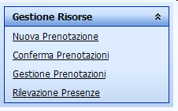

Le funzioni di questa sezione permettono di effettuare prenotazioni per aule o risorse mobili e di gestire le prenotazioni qualora l’utente sia responsabile di qualche risorsa.

Nuova Prenotazione
---
Consente di fare ricerche di disponibilità di strutture dell’ateneo ed inoltrare una richiesta di utilizzo (prenotazione) al gestore della struttura. In assenza di responsabile della struttura l’utente potrà direttamente occupare lo slot di tempo trovato libero nell’agenda della struttura.

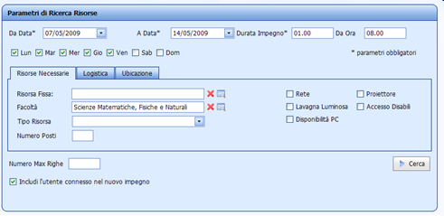

* Da data
  * Data inizio del periodo all’interno del quale cercare una disponibilità di allocazione
* A data
  * Data fine del periodo all’interno del quale cercare la disponibilità di allocazione
* Durata prevista impegno
  * Ore previste di durata dell’evento-impegno da allocare
* Selezione giorni della settimana
  * Checkando i singoli giorni, la ricerca si concentra solo sui giorni indicati in modalità “OR”
* Risorse necessarie
  * Caratteristiche delle risorse fisse necessarie allo svolgimento dell’impegno (tipo risorsa, numero posti, accesso alla rete, ecc..). E’ possibile anche richiedere la disponibilità di una risorsa fissa in particolare ricercandola dall’apposito campo ris.fissa, dove verrà aperta la lookup delle risorse fisse con le eventuali caratteristiche della risorsa stessa. Logistica strutture logistiche di afferenza della risorsa necessarie (Strutt. Org., corso di studio, dipartimento,…)
* Ubicazione
  * Ubicazione fisica della risorsa che si richiede (Città, edificio, piano)

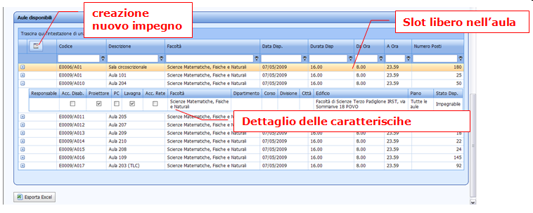

Il risultato della ricerca mostra gli slot liberi sulle singole risorse. I record sono ordinabili secondo diversi criteri (data, giorno, aula, ora, capienza) per dare modo all’utente di individuare meglio quelli desiderati.
Selezionare lo slot desiderato, e cliccare su “nuovo impegno”. Si accede alla funzione per creare l’evento-impegno per l’occupazione della risorsa [Nuovo impegno](../up_web_Calendari).

Conferma prenotazioni
---
Questa funzione web è ad uso del responsabile di una risorsa fissa o mobile, per confermare o rifiutare le prenotazioni da parte di altri utenti. Ogni riga è una prenotazione che riporta: l’aula, data e ora della prenotazione, l’evento.

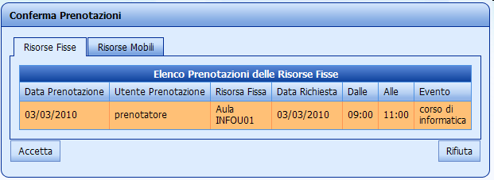

L’operatore può consultare i dettagli dell’evento, e accettare oppure rifiutare la prenotazione. In caso di accettazione l’impegno passa da stato “prenotato” a stato “confermato”. In caso di rifiuto, viene cancellata la prenotazione.

Gestione prenotazioni
---
E’ la funzione web ad uso di chiunque abbia effettuato una prenotazione di una risorsa fissa o mobile. E' possibile monitorare lo stato globale della prenotazione e del dettaglio
delle risorse coinvolte.

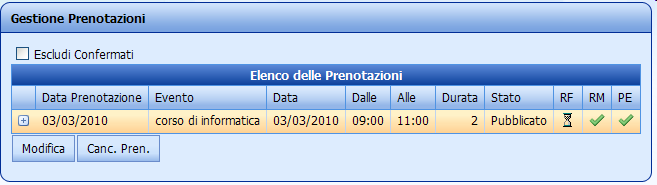

Gestione rilevazione presenze
E’ la funzione web ad uso del di un operatore addetto alla rilevazione delle presenze reali agli impegni schedulati. E’ prevista analoga funzionalità che su supporto palmare.

Selezionare edificio e piano. Per default, come giorno di rilevazione si propone la data corrente. Lanciando la ricerca si recuperano tutti gli impegni in un piano-edificio

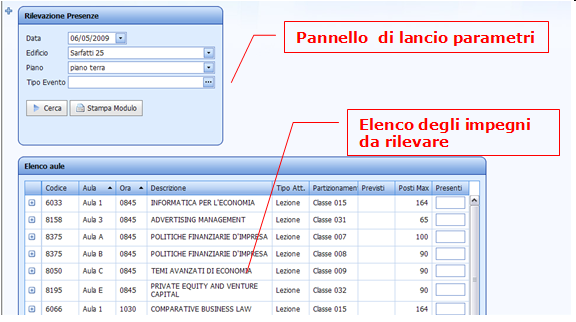

I risultati possono essere ordinati per ora, evento, aula, per agevolare l’operatore nell’individuazione degli impegni da completare

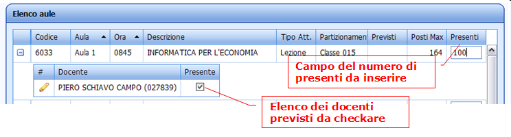

Dalla maschera di lancio è inoltre possibile stampare il report cartaceo di rilevazione presenze.

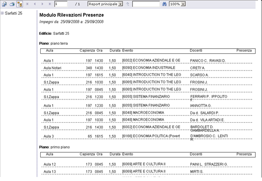

**Gestione rilevazione presenze (Esami)**

Nel caso in cui la rilevazione venga effettuata per Tipo Evento “Esami”, il modulo fornisce il dettaglio delle singole ore.

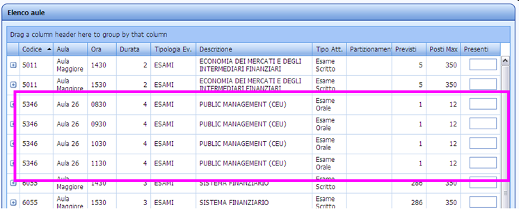

Nell’esempio è riportato il caso di un Impegno della durata di 4 ore, dalle 8:30 alle 12:30, in cui sono state evidenziate le 4 righe relative all’inserimento delle presenze.

Tramite il bottone “Stampa Modulo” si accede alla stampa del modulo, che in questo caso è stata allineata alla form, riportando tante righe quante sono le ore di durata dell’impegno (4 in questo esempio).  

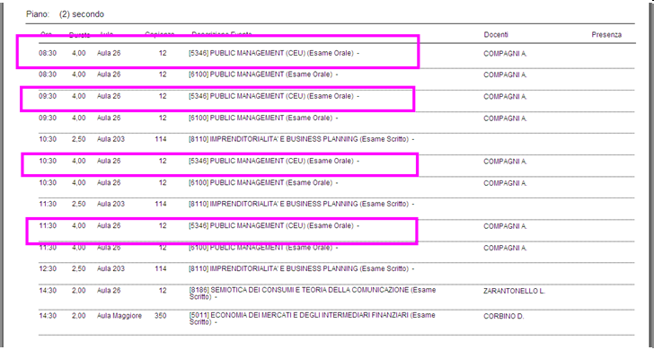

Nel caso fossero state già caricate delle presenze, ma l’Impegno dovesse essere cambiato in una sua identificazione (es. incrementato di un ora), è possibile scegliere di ricaricare la form Tramite il bottone “Ricrea Dett Pres Esami”, previo aver selezionato una delle righe dell’Impegno modificato.

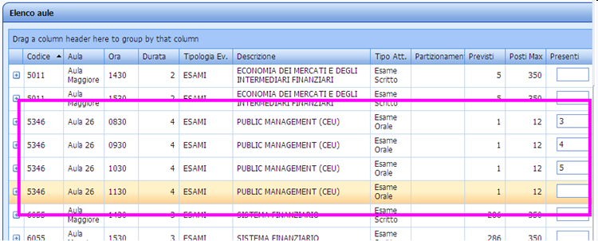

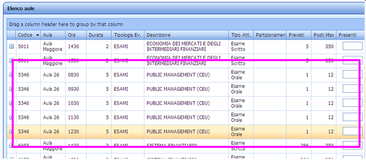

In questo modo verrà inserita una nuova riga, relativa allo slot orario aggiunto (nell’esempio 12:30), e erranno cancellate le presenze già caricate (solo per l’Impegno in esame).  
