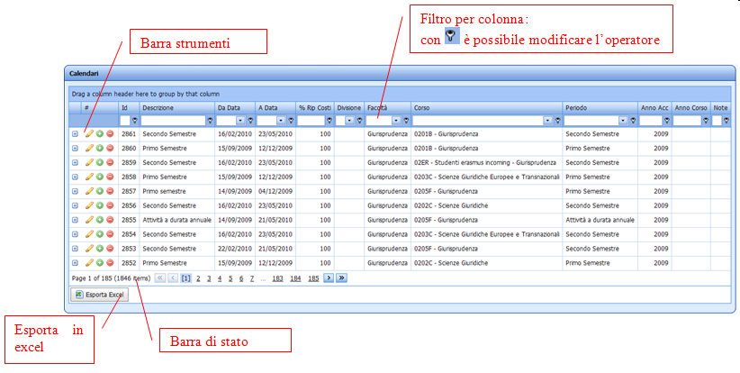
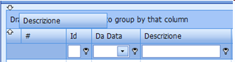
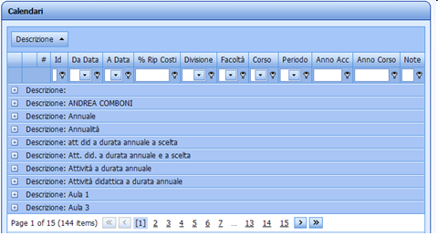
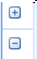
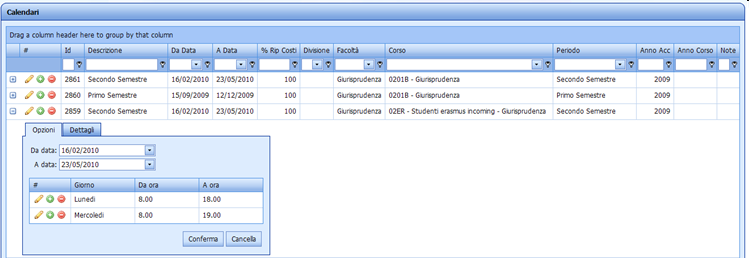
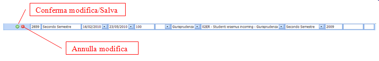

Utilizzo generale delle griglie Web
---
Ecco alcune indicazioni per l’utilizzo generale delle griglie Web, in uso soprattutto per la gestione delle tabelle di configurazione.

Le principali novità rispetto alle versioni precedenti sono:

*	Tutti i campi sono visualizzati nella stessa pagina
*	I dettagli sono visualizzati aprendo con l’apposita icona + la singola riga
*	Tutte le modifiche ad una riga vengono salvate senza fastidiosi refresh della pagina
*	Possibilità di filtrare per colonna
*	Possibilità di Raggruppare per colonna (trascinare la colonna nell’apposita area sopra l’intestazione delle colonne)

Le modalità di ricerca e di gestione della griglia rimangono pressoché invariate. E’ attiva la funzionalità di ridimensionamento delle colonne e rimane la possibilità di ordinarle in modo personalizzato.

Strumenti
---
Le funzionalità della barra operativa agiscono sulla singola riga:

* Apri e chiudi dettaglio:

* Modifica:

* Modifica:

* Aggiungi record:

* Elimina:

