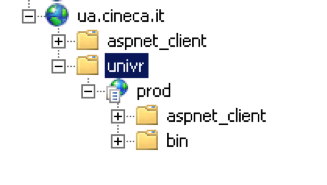
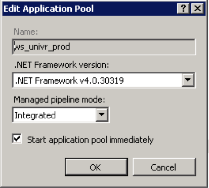
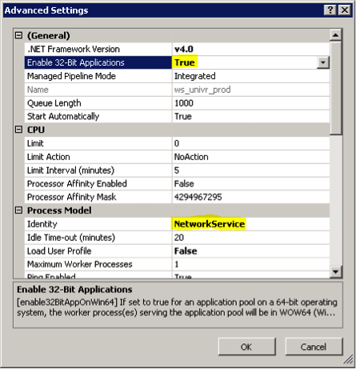

# Configurazione IIS per Cineca

I device degli studenti si collegheranno a questi webservice per interagire con i database dell’applicazione.
Le directory di lavoro saranno:

| Percorso | Descrizione|
|----------|------------|
| D:\IUNIV\api\uniXX\prod | Installazione in produzione|
| D:\IUNIV\api\uniXX\preprod | Installazione in pre-produzione|


Tali url dovranno essere sempre disponibili su internet e risponderanno all’indirizzo così composto:

* http://ua.cineca.it/unixx/prod/....
* http://ua.cineca.it/unixx/preprod/....

A fronte di una nuova installazione va :
* Scompattato il file compresso nella corretta directory
* Modificato il file web.config con le informazioni di connessione al database

```
IUNIV_UNIXX_PROD (TEST).
DATA SOURCE
USER ID
PASSWORD
```

Verificare il TNSNAMES.ORA relativamente al datasource necessario per la connettività al database.

L’installazione va effettuata utilizzando le porte standard e non le porte sicure 443.



Va creata un application pool ad hoc con i parametri che seguono i: e più in dettaglio:

-	Abilitare i 32 bit
-	Cambiare identity in NetworkService






Configurare unicamente Anonymous Authentication e disbilitare gli altri metodi di autenticazione
Per pulizia dell’ambiente rimuovere eventualmente tutti i default document.
