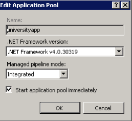
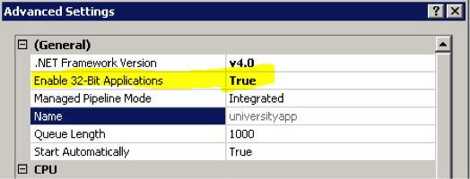
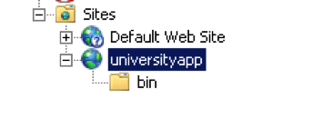

# Configurazione IIS standard

L’installazione va effettuata utilizzando le porte standard e non le porte sicure 443.
Va creata un application pool ad hoc con questi parametri:

inoltre, cliccando su Advanced settings, occorra abilitare i 32 bit.

Creare una cartella universityapp dove poi decomprimere il file iuniversity.zip.
La cartella dovrà essere una virtual directory di un website già presente, oppure un website totalmente nuovo, questo a seconda delle esigenze del cliente, tenendo conto comunque che tale indirizzo dovrà essere pubblico e sempre raggiungibile, in quanto in comunicazione con i device mobile (http://mobile.universita.it/universityapp, ad esempio nel caso di virtual directory di un website già esistente, oppure http://mobile.universita.it sempre come esempio, nel caso di nuovo website).

Configurare unicamente Anonymous Authentication e disbilitare gli altri metodi
Per pulizia dell’ambiente rimuovere eventualmente tutti i default document.
Il link pubblico sarà quello da comunicare ai configuratori per salvare la configurazione su APILOCATE

