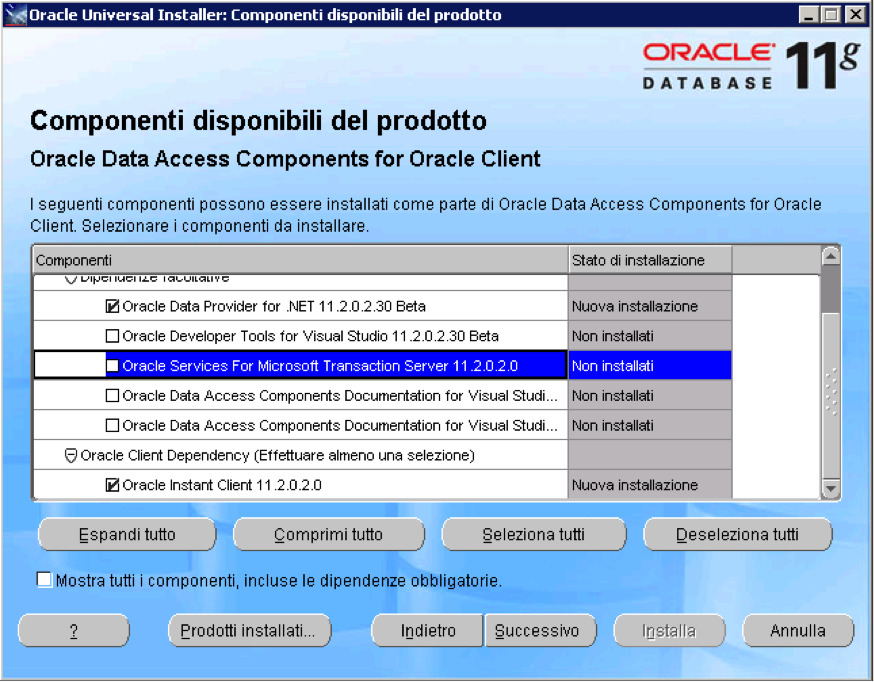

# Client Oracle

L'installazione del client Oracle deve prevedere obbligatoriamente l'aggiunta del componente Oracle Data Access(ODAC)...

Il client oracle deve essere installato nella versione a 32 bit

A tal riguardo si riporta di seguito la schermata principale in cui sono selezionate le opzioni indispensabili.

