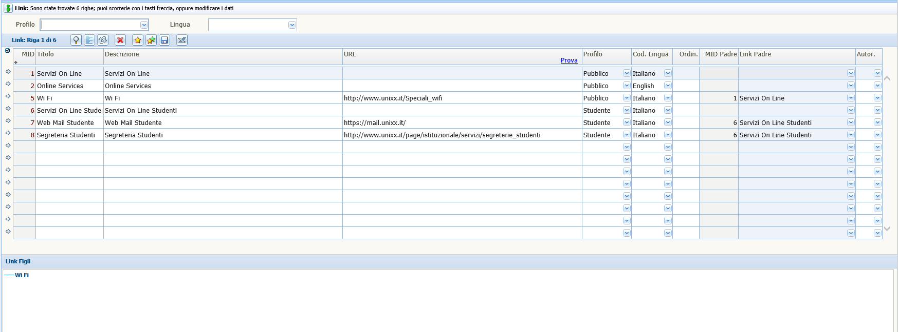
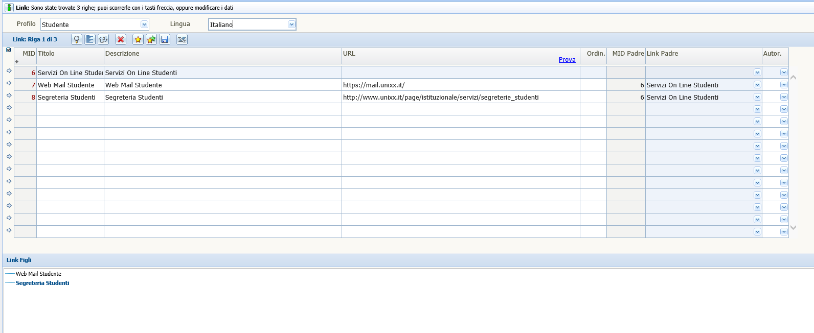
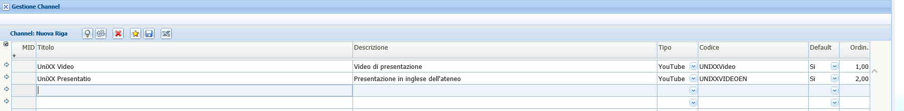
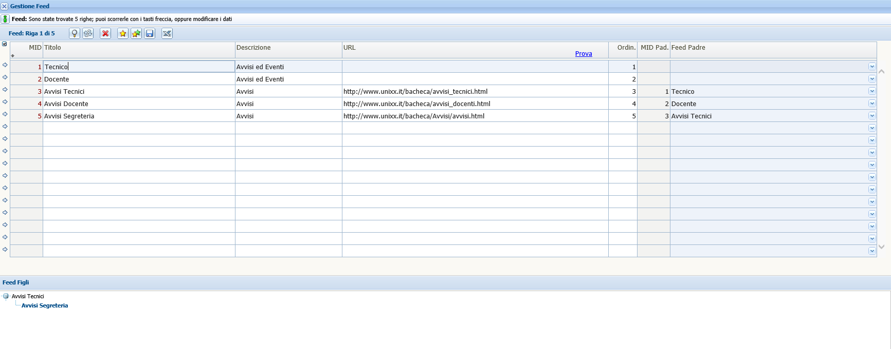

# Funzionalità Contenuti

### Gestione Link

In questa videata è possibile gestire i vari link che verranno messi a disposizione nel device a seconda del profilo configurato e della lingua configurata.

Oltre ad inserire la configurazione del link, del nome, del profilo a cui deve essere visto, e la lingua di appartenza, è necessario configurare anche il padre a cui il link deve appartenere. Come si nota dalla fig. 3 nella stessa videata è possibile inserire i link padre e i link figlio corrispondenti.

(fig. 3)

E' presente nella videata un link di *Prova* presente nel titolo del campo *URL* che è utile all'utente per provare prima della pubblicazione, se il link inserito è corretto. Il sistema apre il link in una nuova scheda, in modo da verificare la correttezza.

Nella seconda videata riportata (fig. 4), si è filtrato, nella parte superiore, per profilo studente e lingua Italiano.

E' importante evidenziare che un figlio deve avere lo stesso profilo e la stessa lingua del padre. Non è possibile associare un figlio con profilo diverso o lingua diversa.

(fig. 4)

### Gestione Channel

In questa videata l'ateneo può inserire i propri canali di pubblicazione, che saranno visibili nella applicazioni nella apposita sezione.

E' necessario inserire il titolo, la descrizione, il tipo di lettore con cui si vuole riprodurre il video (you-tube o vimeo), il codice con cui il sistema codifica il canale da visualizzare ed è necessario anche definire se è un canale di default o meno, infine, è possibile inserire l'ordinamento di visualizzazione del canale. Riportiamo la videata di seguito (fig. 5).

(fig. 5)

**MANCA DOVE VIENE CARICATO IL VIDEO E LA FUNZIONA CORRETTA DEL CODICE**

### Gestione Feed

La gestione dei Feed permette da parte dell'ateneo di riportare nella apposita sezione del device un elenco di avvisi ed eventi importanti per i vari utenti finali.

Anche in questo caso è possibile inserire avvisi di tipo padre che racchiudo uno o più figli e figli di figli, come si vede nella videata sotto riportata, (fig. 6).

(fig. 6)

E' presente nella videata un link di *Prova* presente nel titolo del campo *URL* che è utile all'utente per provare prima della pubblicazione, se il link inserito è corretto. Il sistema apre il link in una nuova scheda, in modo da verificare la correttezza.

### Gestione Photo

In questa videata l'ateneo può inserire le proprie fotografie, che saranno visibili nella applicazioni nella apposita sezione.

E' necessario inserire il titolo, la descrizione, il tipo di caricamento della foto, dove il sistema dovrà recuperare la foto (Flickr o Picasa). Il codice con cui il sistema codifica la fotografia da visualizzare, infine, è possibile inserire l'ordinamento di visualizzazione del canale. Riportiamo la videata di seguito (fig. 7).

(fig. 7)

**MANCA DOVE VIENE CARICATO IL VIDEO E LA FUNZIONA CORRETTA DEL CODICE**

