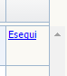
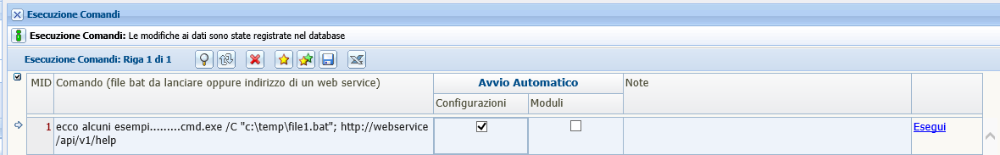

# Gestione Configurazione


### Configurazioni

La videata delle Configurazioni racchiude l'elenco completo dei parametri che vengono utilizzati nella applicazione per eseguire operazioni diverse. La videata viene aperta in modalità dettaglio, per visualizzare tutti i vari parametri presenti è possibile passare alla modalità in lista tramite l'icona  presente nella toolbar.

Di seguito riportiamo una tabella dove elenchiamo tutti i parametri utilizzati nella applicazione, la loro descrizione, la loro visibilità e indichiamo la funzionalità all'interno della applicazione.

Facciamo presente che ogni modifica dei campi di questa videata, verrà eseguito dei comandi automatici.

Si rimanda alla pagina dedicata [Gestione Parametri](../gestione_parametri/index.html).

### Moduli

In questa maschera l'utente tramite i flag presenti nella videata può decidere se rendere accessibili i singoli moduli nelle applicazioni di IOS o di Android.

Facciamo presente che ogni modifica dei campi di questa videata, verrà eseguito dei comandi automatici.

Si rimanda alla pagina dedicata [Gestione Moduli](../moduli_mobile/index.html).


### Esecuzione Comandi

In questa videata l'utente ***configuratore*** può configurare uno o più comandi che verranno eseguiti a seconda della impostazione che viene definita nella riga del comando.
I check presenti nella videata permettono di definire l'esecuzione del comando, quando l'utente modifica i campi della videata *Configurazioni* o della videata *Moduli*, il comando verrà eseguito automaticamente.
In alternativa, il comando può sempre eseguito da questa videata tramite il link *Esegui*  a discrezione dell'utente.

Nel campo *Comando* della videata sono riportati alcuni esempi di scrittura di comando, che riportiamo anche qui di seguito.

Nel campo *Note* è possibile inserire una descrizione di cosa effettua il comando appena creato.

```
cmd.exe /C "c:\temp\file1.bat"; http://webservice/api/v1/help```

Riportiamo per maggior chiarezza la videata di riferimento.




