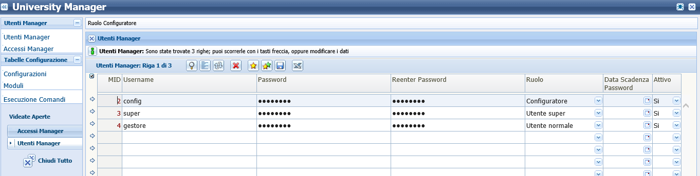
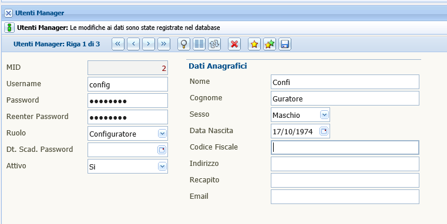

# Gestione Utenti

# Gestione Utenti App Manager

### Utenti Manager

La videata racchiude l'elenco degli utenti che possono accedere alla applicazione.

L'utente ***configuratore*** può inserire, modificare gli utenti che possono accedere alla applicazione. Per l'inserimento è necessario inserire una nuova riga con i dati richieti e salvare tramite l'icona  presente nella toolbar della videata.

E' possibile visualizzare la videata in due modalità: *lista* (fig. 1) o *dettaglio* (fig. 2). La videata al momento della apertura si trova in modalità lista, per passare alla modalità dettaglio è necessario cliccare sulla icona  presente nella toolbar. Nella modalità di dettaglio è possibile inserire anche i dati anagrafici dell'utente, mentre in modalità lista sono presenti i campi richiesti per il salvataggio dell'utente.

(fig. 1)

(fig. 2)

I ruoli che un utente può assumere sono tre:
* configuratore
* utente super
* utente normale

Rimandiamo alle varie pagine descritte per le specifiche differenti di ciascun ruolo.

Per disabilitare un utente all'accesso dell'applicativo, è necessario o inserire un valore nel campo *Data Scadenza Password*, oppure modificare il flag *Attivo* con il valore *No*. sconsigliamo di effettuare l'eliminazione completa dell'utente.

E' possibile eseguire una esportazione dei dati presenti nella tabella con l'icona  presente nella toolbar, il sistema crea un file .csv e chiedi di salvarlo nel vostro dispositivo.

### Accessi Manager

Nella videata Accessi Manager, trovate l'elenco degli utenti con relativa data di login e di logout che hanno effettuato un accesso alla applicazione.

E' possibile eseguire una esportazione dei dati presenti nella tabella con l'icona  presente nella toolbar, il sistema crea un file .csv e chiedi di salvarlo nel vostro dispositivo.

La videata si apre in modalità ricerca. L'utente in questo modo può inserire direttamente una ricerca specifica per data o utente, in modo da avere un risultato immediato. Per effettuare questa operazione, è necessario inserire il valore ricercato nel campo corrispondente e cliccare successivamente sulla icona  presente nella toolbar. Se non si inserisce alcun tipo di ricerca, il sistema recuperà tutti i dati presenti nella tabella.

## Configuratore

L'utente che accede alla applicazione con il ruolo di ***configuratore*** è l'utente che può gestire la creazione di altri utenti, gestire i moduli, configurare i parametri necessari al funzionamento della applicazione e può creare ed eseguire nuovi comandi per l'applicazione.

Le voci di menù che l'utente ***configuratore*** vede al momento del proprio accesso nella applicazione sono:

* Utenti Manager
* Tabelle Configurazione

## Utente Super

L'utente che accede alla applicazione con il ruolo di ***utente super*** è l'utente che può gestire la creazione di altri utenti, gestire i moduli ed eseguire le funzionalità della applicazione.

Le voci di menù che l'utente ***utente super*** vede al momento del proprio accesso nella applicazione sono:

* Utenti Manager
* Tabelle Configurazione
* Funzionalità Contenuti

## Utente Normale

L'utente che accede alla applicazione con il ruolo di ***utente gestore*** è l'utente che può gestire la creazione di  eseguire le funzionalità della applicazione.

La voce di menù che l'utente  ***utente gestore*** vede al momento del proprio accesso nella applicazione è *Funzionalità*.

* [Gestione Link](../funzionalita_contenuti/index.html).
* [Gestione Channel](../funzionalita_contenuti/index.html).
* [Gestione Feed](../funzionalita_contenuti/index.html).
* [Gestione Photo](../funzionalita_contenuti/index.html).

